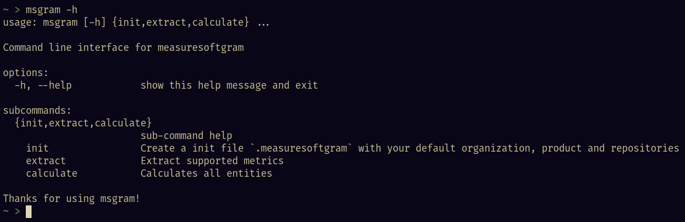

## 1. Versionamento

Versão|Data|Descrição|Autor(es)
------|----|---------|--------
0.1   | 29/01/2023 | Criação do documento | João Pedro
1.0   | 29/01/2023 | Adição do manual de uso da CLI v1.0.0 | João Pedro

## 2. Manual de Uso da `CLI`

### 2.1 O que é o microsserviço `CLI`

<p align="justify" style="text-indent: 20px">
    Esse microsserviço dentro do produto MeasureSoftGram se trata da interface de linha de comandos, que utiliza o pacote de cálculos da Core por trás dos panos, para gerar análises de qualidade dos repositórios. Se trata de um pacote <a href="https://pypi.org/project/msgram/">Pypi</a> totalmente independente, que tem como foco a utilização local (sem necessidade de internet).
</p>

### 2.2 Como executar a `CLI`

<p align="justify" style="text-indent: 20px">
    Para iniciar a utilização da CLI, baixe o pacote do repositório <a href="https://pypi.org/project/msgram/">Pypi</a>.
</p>

```sh
pip install msgram
```

<p align="justify" style="text-indent: 20px">
    Agora todas as funcionalidades disponíveis da CLI do MeasureSoftGram estão disponíveis pelo seguinte comando: msgram
</p>

```sh
msgram -h
```



