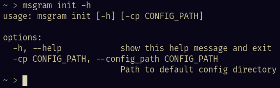
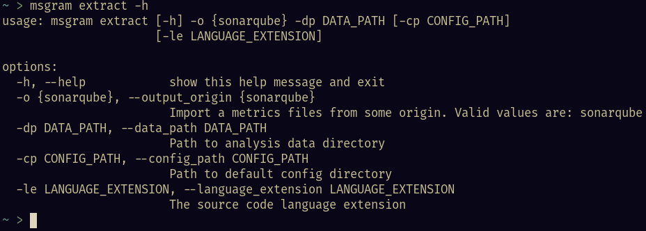
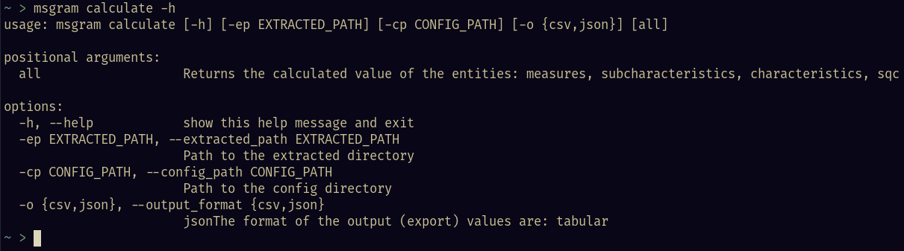

## 1. Versionamento

Versão|Data|Descrição|Autor(es)
------|----|---------|--------
0.1   | 29/01/2023 | Criação do documento | João Pedro
1.0   | 29/01/2023 | Adição do manual de uso da CLI v1.0.0 | João Pedro
1.1   | 29/01/2023 | Adição dos comandos existentes na CLI | João Pedro
1.2   | 29/01/2023 | Adição de vídeo demonstrativo da CLI  | João Pedro

## 2. Manual de Uso da `CLI`

### 2.1 O que é o microsserviço `CLI`

<p align="justify" style="text-indent: 20px">
    Esse microsserviço dentro do produto MeasureSoftGram se trata da interface de linha de comandos, que utiliza o pacote de cálculos da Core por trás dos panos, para gerar análises de qualidade dos repositórios. Se trata de um pacote <a href="https://pypi.org/project/msgram/">Pypi</a> totalmente independente, que tem como foco a utilização local (sem necessidade de internet).
</p>

### 2.2 Como executar a `CLI`

<p align="justify" style="text-indent: 20px">
    Para iniciar a utilização da CLI, baixe o pacote do repositório <a href="https://pypi.org/project/msgram/">Pypi</a>.
</p>

```sh
pip install msgram
```

<p align="justify" style="text-indent: 20px">
    Agora todas as funcionalidades disponíveis da CLI do MeasureSoftGram estão disponíveis pelo seguinte comando: msgram
</p>

```sh
msgram -h
```


### 2.3 Comandos existentes na `CLI`

<p align="justify" style="text-indent: 20px">
    Como demonstrado na foto anterior, a CLI do MeasureSoftGram possui três comandos:
</p>

#### 2.3.1 msgram init

<p align="justify" style="text-indent: 20px">
    Responsável por inicializar os arquivos e pastas de configuração que são utilizados nos comandos seguintes. O arquivo <b>msgram.json</b> de configuração das entidades é criado nessa etapa.
</p>

``` sh
msgram init -h
```

<center>



</center>

Exemplo de configuração de qualidade gerado pelo <b>init</b>:

``` json
{
    "characteristics": [
        {
            "key": "reliability",
            "weight": 50,
            "subcharacteristics": [
                {
                    "key": "testing_status",
                    "weight": 100,
                    "measures": [
                        {
                            "key": "passed_tests",
                            "weight": 33
                        },
                        {
                            "key": "test_builds",
                            "weight": 33
                        },
                        {
                            "key": "test_coverage",
                            "weight": 34
                        }
                    ]
                }
            ]
        },
        {
            "key": "maintainability",
            "weight": 50,
            "subcharacteristics": [
                {
                    "key": "modifiability",
                    "weight": 100,
                    "measures": [
                        {
                            "key": "non_complex_file_density",
                            "weight": 33
                        },
                        {
                            "key": "commented_file_density",
                            "weight": 33
                        },
                        {
                            "key": "duplication_absense",
                            "weight": 34
                        }
                    ]
                }
            ]
        }
    ]
}
```

#### 2.3.2 msgram extract

<p align="justify" style="text-indent: 20px">
    Responsável por extrair os dados advindos dos análisadores de código (parsers). Até a versão 1.0.0, o MeasureSoftGram suporta as seguintes entidades:
</p>

??? info "Características disponíveis"

    - Reliability
    - Maintainability

??? info "Subcaracterísticas disponíveis"

    - testing_status
    - modifiability

??? info "Medidas disponíveis"
    - passed_tests
    - tests_build
    - test_coverage
    - non_complex_file_density
    - commented_file_density
    - duplication_absense

??? info "Métricas disponíveis"
    - tests [sonarqube]
    - tests_failures [sonarqube]
    - test_errors [sonarqube]
    - test_execution_time [sonarqube]
    - coverage [sonarqube]
    - functions [sonarqube]
    - complexity [sonarqube]
    - comment_lines_density [sonarqube]
    - duplicated_lines_density [sonarqube]

``` sh
msgram extract -h
```

<center>



</center>

#### 2.3.3 msgram calculate

<p align="justify" style="text-indent: 20px">
    Responsável por calcular, através do <a href="https://pypi.org/project/msgram-core/">msgram-core</a> (versão empacotada dos cálculos), a qualidade dos arquivos extraidos. Também, por esse comando o MeasureSoftGram extrai os dados (CSV ou JSON) calculados.
</p>

```sh
msgram calculate -h
```

<center>



</center>

## 3. Demonstração de uso da `CLI`

<p align="justify" style="text-indent: 20px">
    O seguinte vídeo, demonstra a utilização da CLI para cálculo da qualidade do produto MeasureSoftGram:
</p>

<iframe style="width: 100%; height: 400px" src="https://www.youtube.com/embed/rSzV_5ZTXio" title="MeasureSoftGram - Guia de Uso" frameborder="0" allow="accelerometer; autoplay; clipboard-write; encrypted-media; gyroscope; picture-in-picture; web-share" allowfullscreen></iframe>
