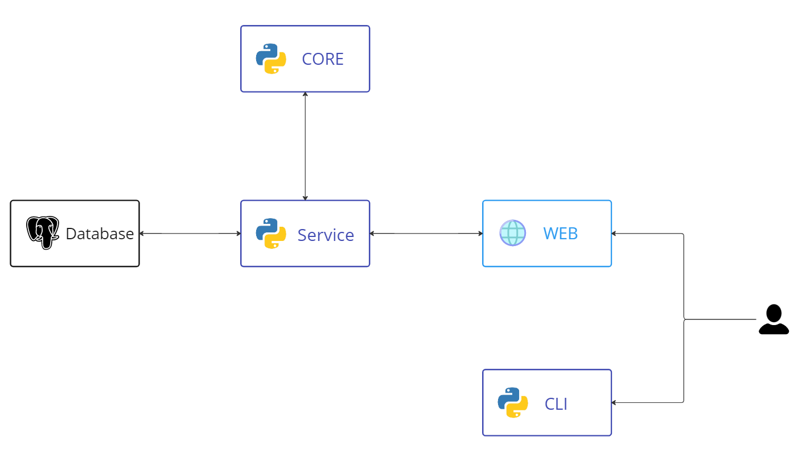
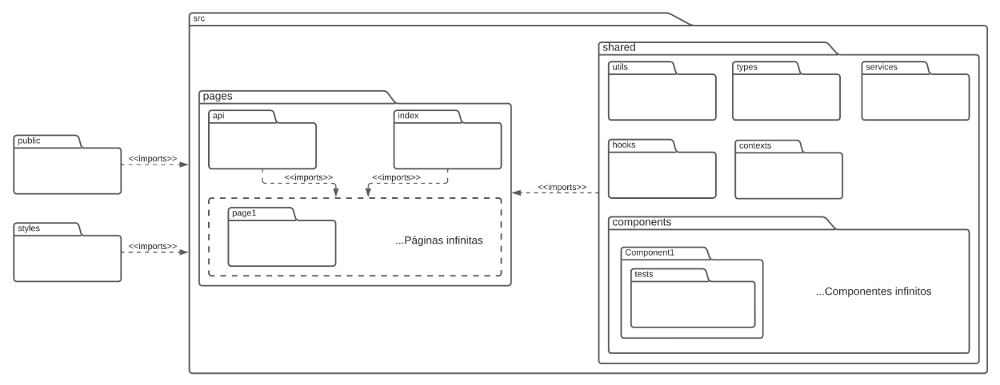
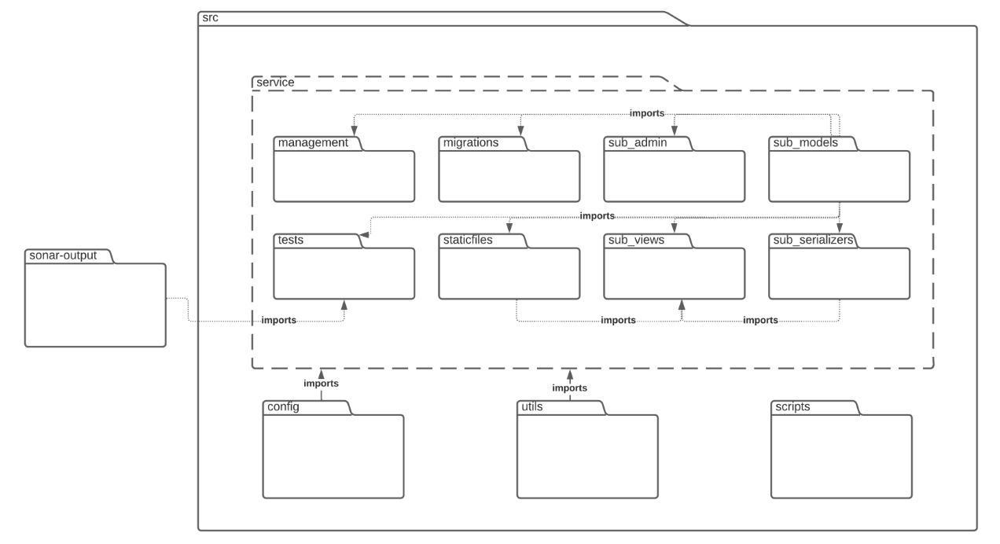
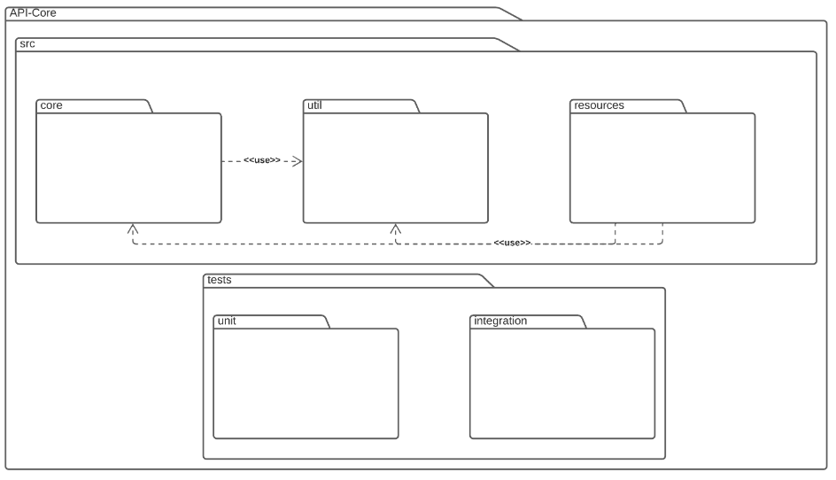
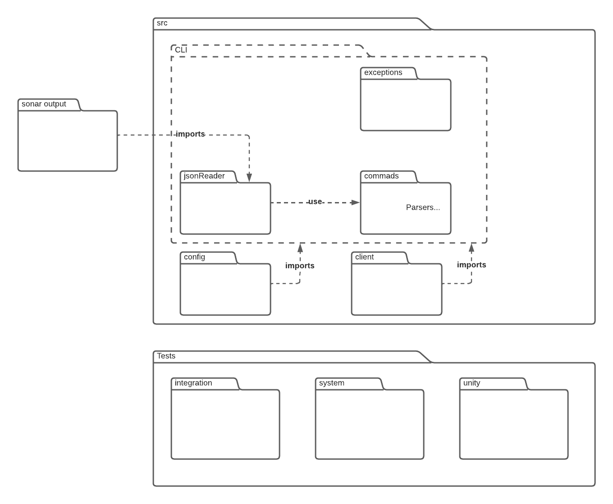

# Documento de Arquitetura

## Versionamento

| Data | Versão | Descrição | Autor(es) |
|------|------|------|------|
|28/11/2022|1.0|Criação do documento| João Victor Valadão e Ítalo Fernandes |
|28/11/2022|1.1|Adicionando Tecnologias| Ítalo Fernandes e João Victor Valadão |
|28/11/2022|1.2|Adicionando Metas e Restrições| Ítalo Fernandes e João Victor Valadão |
|29/11/2022|1.3|Adicionando Diagrama arquitetural | João Victor Valadão e Ítalo Fernandes |
|29/11/2022|1.4|Adicionando diagramas de pacotes e atualização do diagrama arquitetural | João Victor Valadão e Ítalo Fernandes |
|30/11/2022|1.5| Atualização da arquitetura diagrama de pacotes | João Victor Valadão e Ítalo Fernandes |
|07/11/2022|1.6| Revisão do documento | João Moura |

## Introdução

### Finalidade

 &emsp;&emsp; Este documento tem como objetivo apresentar uma visão geral sobre a arquitetura do Measure SoftwareGram. Aqui estarão presentes informações sobre as tecnologias utilizadas no projeto, modelo de arquitetura seguido e as motivações que guiam essas escolhas 

### Escopo

 &emsp;&emsp; Através desse documento, é possível obter um melhor entendimento da arquitetura do projeto, permitindo ao leitor a compreensão do funcionamento do sistema e as abordagens utilizadas para o seu desenvolvimento.

### Visão Geral

* Introdução: Apresentar uma visão geral sobre o conteúdo dessa documentação;
* Representação de Arquitetura: Descreve as tecnologias e os padrões de arquitetura utilizados e informa as razões que motivaram tais escolhas;
* Metas e Restrições de Arquitetura: Fala sobre objetivos que buscam ser alcançados dentro da arquitetura escolhida;
* Referências: Emprega as fontes utilizadas nas pesquisas para relacionar as publicações que foram consultadas e citadas.

## Representação de Arquitetura

### Tecnologias

- **Python**: Uma linguagem de programação de alto nível que permite a estabilidade do projeto com alta escalabilidade. Ele pode ser usado para criar interfaces simples em terminais de computadores.

- **JavaScript/TypeScript**: Uma linguagem de programação de alto nível que é interpretada de forma estruturada. JavaScript é uma das três principais tecnologias da World Wide Web, junto com HTML e CSS. Usaremos TypeScript, que estende o JavaScript com digitação estática opcional.

#### Frontend

- **React**: Um framework em JavaScript que suporta TypeScript, desenvolvida pelo Facebook. Proporciona o desenvolvimento de sites com mais facilidade e rapidez do que os tradicionais HTML, CSS e JavaScript.

- **Next.js**: Uma estrutura da Web de desenvolvimento front-end React de código aberto criada pela Vercel, que permite geração de sites estáticos para aplicativos da Web baseados em React e recursos como renderização do lado do servidor.

#### Backend

- **Django**: um Framework open source baseado em Python. Altamente escalável e robusto, foi projetado para resolver problemas comuns durante o desenvolvimento web, disponibilizando diversas facilidades como: ORM, autenticação, rotas, e <i>migrations</i> [<a href=./#referencia>1</a>].

- **Jupyter Notebook**: Uma ferramenta open source para criar e editar Notebooks. Sendo uma tecnologia baseada em Python.

#### CLI

**CLI** Abreviação de "interface de linha de comando". Este é um programa que permite aos usuários criar comandos para funções específicas passando instruções para o computador.

- **PyPI**: O Python Package Index [<a href=./#referencia>2</a>] é um repositório para armazenar pacotes de código escritos na linguagem de programação **Python**.

#### Banco de dados

- **PostgreSQL**: Um sistema de gerenciamento de banco de dados relacional de software livre. Tem a capacidade de gerir os dados de forma organizada e eficaz.

## Diagrama arquitetural

## Diagrama de Pacotes

### Web

### Service

### Core

### CLI

## Metas e Restrições de Arquitetura

### Metas

|     Metas      |                                                                           |
| :------------: | :-----------------------------------------------------------------------: |
| Escalabilidade | A aplicação deverá ser escalável                                          |
|   Segurança    | A aplicação deverá tratar de forma segura os dados sensíveis dos usuários |
|     Deploy     | A aplicação deverá possuir deploy automatizado                            |

### Restrições

| Restrições    |                                                                                                                  |
| :-----------: | :--------------------------------------------------------------------------------------------------------------: |
| Conectividade | Para utilização do <b>Frontend</b> é preciso ter conexão com a internet. Para utilizar o <b>CLI</b> isso já não é mais necessário                                       |
|  Plataforma   | A aplicação possuirá suporte WEB e para linha de comando                                                         |
|    Público    | A aplicação será desenvolvida com foco em empresas de tecnologia e desenvolvedores                               |
|   Linguagem   | O inglês foi escolhido por conta das integrações com plataformas que já utilizam essa linguagem                  |
|    Equipe     | A equipe possui 11 integrantes                                                                                   |
|     Prazo     | O prazo é até o final do semestre 2022-2 (18/02/2023) da Universidade de Brasília                                |

## Referências

> [1] ROVEDA, Ugo; <b>O que é Django, para que serve e como usar este framework</b>. Disponível em: < [https://kenzie.com.br/blog/django](https://kenzie.com.br/blog/django) > Acesso em: 28 de Novembro de 2022

> [2] <b>Python Package Index Org</b>. Disponível em: < [https://pypi.org/.](https://pypi.org/.) > Acesso em: 28 de Novembro de 2022

> Template Documento de Arquitetura de Software. Disponível em: < [https://github.com/DroidFoundry/DroidMetronome/wiki/TEMPLATE-Documento-de-Arquitetura-de-Software](https://github.com/DroidFoundry/DroidMetronome/wiki/TEMPLATE-Documento-de-Arquitetura-de-Software) > Acesso em: 28 de Novembro de 2022

> Arquitetura do Sistema (MeasureSoftGram-2022-1). Disponível em: < [https://fga-eps-mds.github.io/2022-1-MeasureSoftGram-Doc/#/documentos/documento_de_arquitetura](https://fga-eps-mds.github.io/2022-1-MeasureSoftGram-Doc/#/documentos/documento_de_arquitetura) > Acesso em: 29 de Novembro de 2022
