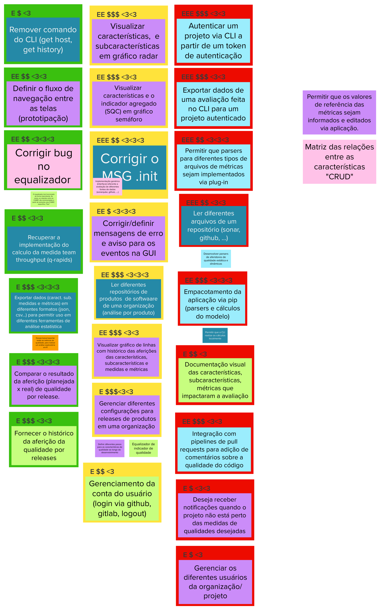
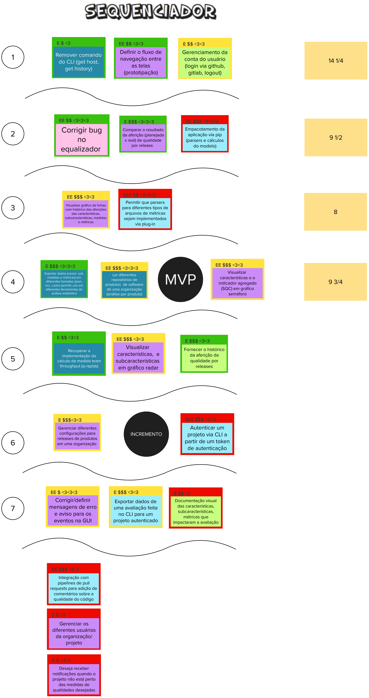

# Visão de Produto

|    Data    | Versão |                  Descrição da revisão                     |      Autor      |
| :--------: | :----: | :-------------------------------------------------------: | :-------------: |
| 07/12/2022 |  1.0   |                  Criação do documento                     | Ítalo Fernandes |
| 10/12/2022 |  1.1   |             Adição da Joranda e Brainstorm                | Ítalo Fernandes |
| 10/12/2022 |  1.2   |   Adição da Revisão Técnica, Sequenciador e Canvas MVP    |   Ítalo Alves   |
| 12/12/2022 |  1.3   |              Adição do Kickoff e correções                |   Ítalo Alves   |
| 20/12/2022 |  1.4   | Correção da referência e adição dos padrões de parágrafos | Ítalo Fernandes |
| 20/12/2022 |  1.5   |   Atualização das imagens do Sequenciador e Canvas MVP    | Ítalo Fernandes |
| 20/12/2022 |  1.6   |       Atualização da quarta Persona e sua Jornada         | Ítalo Fernandes |

## Introdução

Para se obter uma visão de produto essencial para o desenvolvimento do projeto, foi utilizado o método Lean Inception proposto por Paulo Carolli. Esse método abrange um workshop colaborativo para alinhar o grupo sobre o MVP (Produto mínimo Viável) que será construído [<a href=./#referencia>1</a>]. Sendo assim, foram feitas as seguintes etapas.

## Kickoff e Agenda

O Kickoff é uma reunião realizada na fase inicial de um projeto com o intuito de alinhar todos os detalhes entre os envolvidos, o cliente e os membros da equipe, por exemplo.

Nessa etapa foi apresentado o projeto e o propósito principal para que assim pudesse ser definido o objetivo final a ser alcançado.

Foi realizada no dia 02/11/22, via Teams.

## O Produto É - Não é - Faz - Não Faz

A finalidade desta etapa é classificar o produto seguindo as quatro diretrizes, indagando, especificamente, cada aspecto positivo e negativo sobre o produto ser ou fazer algo.

## Visão do Produto

Nesta etapa o objetivo é definir a essência do seu valor de negócio e refletir uma mensagem clara e convincente para o cliente:

## Objetivos do Produto

O objetivo nesta etapa é auxilia no levantamento e esclarecimento dos problemas de acordo com os objetivos gerais do negócio.

## Personas

Nesta etapa para identificar as funcionalidades de um produto, é preciso idealizar os usuários e seus objetivos. Com base nas personas criadas nos semestres passados, atualizamos de acordo com a nova visão do grupo sobre o produto.

## Jornadas de Usuário

Com base em cada persona e suas novas atualizações, a jornada do usuário também foi atualizada para nova visão do grupo:

## Brainstorm de Funcionalidades

Essa etapa segue o refinamento de produtos, listas de metas e personas criados anteriormente. Desta forma, pretende-se descobrir as capacidades e necessidades do usuário representadas pelos papéis necessários para atender aos objetivos.

## Revisão Técnica (Esforço, Negócio, UX)

Essa etapa visa elaborar, reavaliar e normalizar vários recursos propostos durante o brainstorming de recursos, bem como descartar recursos que não fazem sentido para executar neste momento.

Foram realizadas algumas reuniões para a definição desse artefato:

- A primeira foi realizada no dia 21/11/22 (21h15m), via Teams, e durou cerca de 1 hora e 55 minutos.
- A segunda foi realizada no dia 25/11/22 (17h), via Teams, e durou cerca de 1 hora e 30 minutos.

## Sequenciador

Essa etapa auxilia na organização e visualização das funcionalidades e da sequência de validação incremental do produto.

Foram realizadas algumas reuniões para a definição desse artefato:

- A primeira foi realizada no dia 23/11/22 (19h), via Teams, e durou cerca de 30 minutos.
- A segunda foi realizada no dia 25/11/22 (17h), via Teams, e durou cerca de 1 hora e 30 minutos.

## Canvas MVP

O Canvas MVP é um quadro visual que auxilia a equipe a alinhar e definir a estratégia do MVP.

## Referência

> [1] CAROLI, Paulo. Lean Inception: How to Align People and Build the Right Product. 1 ed. São Paulo: Caroli, 2018.