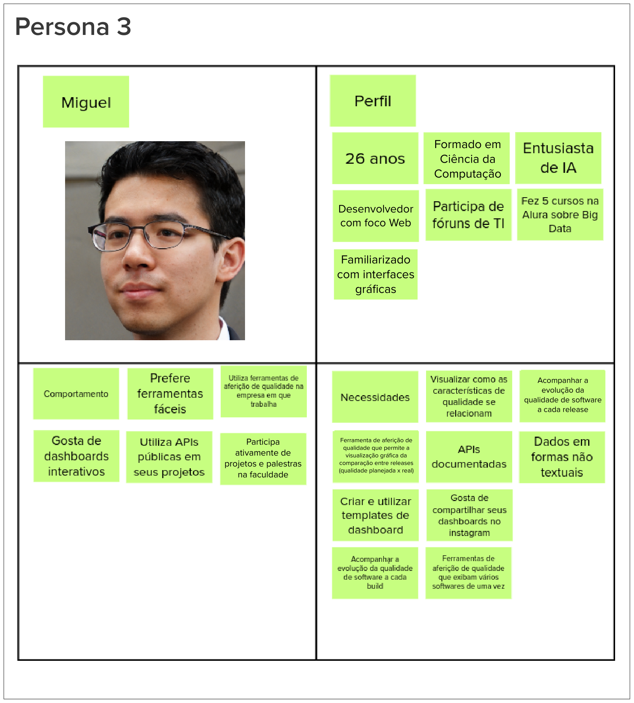

# Visão de Produto

| Data | Versão | Descrição da revisão | Autor |
| :--: | :---: | :------------------: | :----: |
| 07/12/2022 | 1.0 | Criação do documento | Ítalo Fernandes |

## Introdução

Para se obter uma visão de produto essencial para o desenvolvimento do projeto, foi utilizado o método Lean Inception proposto por Paulo Carolli. Esse método abrange um workshop colaborativo para alinhar o grupo sobre o MVP (Produto mínimo Viável) que será construído. Sendo assim, foram feitas as seguintes etapas.

## Kickoff e Agenda

## O Produto É - Não é - Faz - Não Faz

A finalidade desta etapa é classificar o produto seguindo as quatro diretrizes, indagando, especificamente, cada aspecto positivo e negativo sobre o produto ser ou fazer algo.

## Visão do Produto

Nesta etapa o objetivo é definir a essência do seu valor de negócio e refletir uma mensagem clara e convincente para o cliente:

## Objetivos do Produto

O objetivo nesta etapa é auxilia no levantamento e esclarecimento dos problemas de acordo com os objetivos gerais do negócio.

## Personas

Nesta etapa para identificar as funcionalidades de um produto, é preciso idealizar os usuários e seus objetivos. Com base nas personas criadas nos semestres passados, atualizamos de acordo com a nova visão do grupo sobre o produto.

## Jornadas de Usuário

## Brainstorm de Funcionalidades

## Revisão Técnica (Esforço, Negócio, UX)

## Sequenciador

## Canva MVP

## Referência

CAROLI, Paulo. Lean Inception: How to Align People and Build the Right Product. 1 ed. São Paulo: Caroli, 2018.